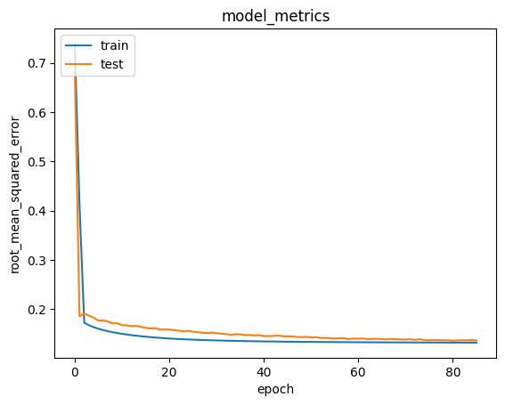

# Laporan Proyek Machine Learning - Hardatama Rakha Ugraha

## Domain Proyek

**Latar Belakang :**

Industri anime telah berkembang menjadi salah satu pilar hiburan digital global dengan jutaan penonton dan ribuan judul yang dirilis tiap tahun. Dengan pertumbuhan konten yang sangat cepat, pengguna sering kali kesulitan dalam menemukan anime yang sesuai dengan preferensi mereka. Oleh karena itu, sistem rekomendasi menjadi sangat penting untuk memberikan pengalaman pengguna yang personal dan efisien.

Proyek ini bertujuan untuk membangun sistem rekomendasi anime berbasis pembelajaran mesin dengan memanfaatkan data rating pengguna dari situs MyAnimeList.net, salah satu platform komunitas anime terbesar di dunia. Dataset yang digunakan mencakup lebih dari 73 ribu pengguna dan 12 ribu anime, yang menyimpan data rating dan preferensi pengguna.

\
**Mengapa dan Bagaimana Masalah Ini Harus Diselesaikan?**

Pengguna cenderung meninggalkan platform ketika mereka tidak bisa menemukan konten yang menarik. Menurut Ricci et al. (2015), sistem rekomendasi dapat meningkatkan retensi dan kepuasan pengguna secara signifikan dalam aplikasi hiburan digital. Oleh karena itu, sistem rekomendasi berbasis machine learning dapat menjadi solusi efisien untuk meningkatkan pengalaman pengguna.

> Referensi:
> Ricci, F., Rokach, L., Shapira, B., & Kantor, P. B. (2015). Recommender Systems Handbook. Springer.
> DOI: http://dx.doi.org/10.1007/978-0-387-85820-3_1

## Business Understanding

**Problem Statements:**

1. Bagaimana cara mengembangkan sistem rekomendasi berbasis content-based filtering untuk memberikan rekomendasi anime yang sesuai preferensi pengguna?
2. Bagaimana cara mengembangkan sistem rekomendasi berbasis collaborative filtering untuk memberikan rekomendasi anime yang sesuai preferensi pengguna?

\
**Goals:**
1. Mengembangkan sistem rekomendasi berbasis content-based filtering untuk memberikan rekomendasi anime yang sesuai preferensi pengguna.
2. Mengembangkan sistem rekomendasi berbasis collaborative filtering untuk memberikan rekomendasi anime yang sesuai preferensi pengguna.

\
**Solution Statements:**
1. Pendekatan 1: Content-Based Filtering
Menggunakan data fitur genre untuk untuk merekomendasikan anime serupa dengan yang pernah ditonton pengguna.
2. Pendekatan 2: Content-Based Filtering
Menggunakan rating user untuk menyarankan anime yang mirip dengan yang telah ditonton pengguna.
## Data Understanding
Dataset yang digunakan tersedia dari platform Kaggle. 

Sumber dataset: https://www.kaggle.com/datasets/CooperUnion/anime-recommendations-database?select=rating.csv

**Fitur-fitur pada Dataset:**
Dataset terdiri dari dua file utama:
1. anime.csv
Berisi metadata dari setiap anime.

| Fitur  | Deskripsi                                                        |
| --------- | ---------------------------------------------------------------- |
| anime\_id | ID unik untuk setiap anime (integer)                             |
| name      | Nama lengkap anime (string)                                      |
| genre     | Daftar genre yang dipisahkan koma (string)                       |
| type      | Jenis anime (TV, Movie, OVA, dll)                                |
| episodes  | Jumlah episode anime (integer, bisa “Unknown”)                   |
| rating    | Rata-rata rating dari pengguna (float, rentang 0–10)             |
| members   | Jumlah pengguna yang menyukai atau mengikuti anime ini (integer) |

Data ini terdiri dari 12.294 baris. Berikut ini adalah kondisi data sebelum dilakukan pembersihan:
- Jumlah nilai kosong (null) = genre (62), type	(25), rating (230)
- Duplikat = 0

Berikut adalah visualisasi heatmap nilai null, dan histogram sebaran awal:

2. rating.csv
Berisi data rating yang diberikan oleh pengguna terhadap anime.

| Variabel  | Deskripsi                                                     |
| --------- | ------------------------------------------------------------- |
| user\_id  | ID pengguna acak (integer)                                    |
| anime\_id | ID anime yang dirating (integer)                              |
| rating    | Rating yang diberikan (1–10), -1 jika tidak memberikan rating |

Data ini terdiri dari 7.813.737 baris. Berikut ini adalah kondisi data sebelum dilakukan pembersihan:
- Jumlah nilai kosong (null) = 0
- Duplikat = 1

Berikut adalah visualisasi heatmap nilai null, dan histogram sebaran awal:

\
**Exploratory Data Analysis (EDA)**

Dilakukan Univariate Analysis untuk masing-masing data yang menunjukkan distribusi fitur numerik. Beberapa insight awal dari eksplorasi data:
-  Rata-rata rating anime adalah 6.47
-  Rata-rata rating yang diberikan pengguna yang menonton animenya adalah 6.14
-  Namun terdapat rating bernilai -1 sebanyak 1.4+ juta (yang artinya pengguna menonton anime tersebut namun tidak memberi rating)
## Data Preparation

Tahap data preparation dilakukan untuk memastikan data siap digunakan dalam pelatihan model machine learning. Adapun langkah-langkah yang dilakukan adalah sebagai berikut:

1. Mengatasi Missing Value
Langkah awal adalah memeriksa nilai yang hilang (missing value) pada data hasil penggabungan antara file anime.csv dan rating.csv, yang telah disimpan dalam variabel data_merged.
Setelah dilakukan pengecekan, ditemukan adanya data yang memiliki nilai kosong (NaN). Oleh karena itu, dilakukan pembersihan data menggunakan fungsi dropna().
Alasan dilakukan:
Data dengan nilai kosong dapat menyebabkan error atau bias saat proses training model. Menghapusnya adalah pendekatan yang umum dilakukan terutama jika proporsi data yang hilang kecil dan tidak berdampak signifikan pada representasi data secara keseluruhan.

2. Mengurutkan Data Berdasarkan anime_id
Setelah data bersih dari missing value, langkah selanjutnya adalah mengurutkan data berdasarkan kolom anime_id.
Alasan dilakukan:
Pengurutan berdasarkan ID membantu dalam indexing dan proses selanjutnya seperti pencocokan ID saat dilakukan merge dengan data lain atau saat rekomendasi berdasarkan ID.

3. Menghapus Data Duplikat
Langkah selanjutnya adalah menghapus baris data yang memiliki anime_id duplikat. Proses ini dilakukan untuk memastikan bahwa setiap anime hanya memiliki satu entri unik dalam data yang digunakan untuk rekomendasi.
Alasan dilakukan:
Keberadaan data duplikat dapat menyebabkan bias dalam analisis maupun model, misalnya anime tertentu bisa dianggap lebih populer karena terhitung lebih dari sekali.

4. Mengonversi Data ke Dalam Bentuk List
Data kemudian diproses lebih lanjut ke dalam format list yang nantinya akan digunakan dalam proses pencocokan dan sistem rekomendasi berbasis konten (content-based filtering).
Langkah ini dilanjutkan dengan membuat struktur dictionary dalam bentuk DataFrame yang berisi kolom id, anime_name, dan genre.
Alasan dilakukan:
Konversi ke dalam bentuk list mempermudah proses transformasi fitur, pencocokan konten (genre), dan pengembangan model sistem rekomendasi berbasis konten. Selain itu, struktur dictionary sangat berguna dalam membangun indeks dan representasi data yang efisien.

## Modeling
Pada proyek ini, dibangun dua model sistem rekomendasi menggunakan pendekatan berbeda: Content-Based Filtering (CBF) dan Collaborative Filtering (CF). Keduanya digunakan untuk menghasilkan Top-N Recommendation, dengan N=10.

**1. Content-Based Filtering (CBF)**
Pendekatan pertama menggunakan teknik Content-Based Filtering dengan memanfaatkan informasi dari kolom genre setiap anime.
- Representasi Fitur: Genre diubah menjadi representasi vektor menggunakan TF-IDF Vectorizer, yang menilai pentingnya suatu genre dalam sebuah anime dibandingkan dengan keseluruhan dataset.
- Perhitungan Similarity: Dihitung dengan cosine similarity antara representasi vektor TF-IDF setiap anime.
- Output: Fungsi anime_recommendations() akan mengembalikan 10 rekomendasi anime yang paling mirip berdasarkan genre dengan anime input yang diberikan pengguna, contohnya: Fullmetal Alchemist: Brotherhood.

Kelebihan:
- Tidak memerlukan data dari pengguna lain.
- Cocok untuk pengguna baru (cold-start) selama konten anime tersedia.

Kekurangan:
- Terbatas pada fitur yang tersedia (hanya genre).
- Tidak bisa menangkap selera pengguna secara personal.

**2. Collaborative Filtering (Neural Network)**
Pendekatan kedua menggunakan Collaborative Filtering berbasis Neural Network, yaitu dengan membuat model deep learning kustom bernama RecommenderNet.
- Data Input: Menggunakan data rating dari pengguna terhadap anime, lalu di-encode ke dalam ID numerik untuk diproses oleh embedding layer.
- Arsitektur Model:
1. Embedding Layer untuk user dan anime.
2. Penjumlahan antara dot product user-anime dengan bias user dan anime.
2. Aktivasi sigmoid untuk menghasilkan prediksi rating.
- Training: Model dilatih menggunakan Binary Crossentropy loss dan dievaluasi dengan Root Mean Squared Error (RMSE).
- Output: Menghasilkan prediksi rating terhadap anime yang belum ditonton oleh user tertentu, lalu disortir untuk memilih Top 10 anime rekomendasi.

Kelebihan:
- Mampu menangkap preferensi unik setiap pengguna.
- Bisa menyarankan anime di luar preferensi konten (genre).

Kekurangan:
- Tidak cocok untuk pengguna baru (cold-start problem).
- Membutuhkan data interaksi yang cukup banyak.
 

## Evaluation

**Metrik Evaluasi**
Pada model Collaborative Filtering, digunakan metrik:

Root Mean Squared Error (RMSE):

Metrik ini digunakan karena dataset ini berupa data rating numerik, dan RMSE dapat memberikan gambaran seberapa jauh prediksi model terhadap nilai aktual.

**Hasil Evaluasi**
- Dari grafik hasil training model, terlihat bahwa nilai RMSE pada data training dan validation terus menurun dan stabil, menunjukkan bahwa model berhasil mempelajari representasi preferensi pengguna dengan cukup baik. Berikut adalah visualisasi metriknya:

- Prediksi rating terhadap anime yang belum ditonton untuk user tertentu menunjukkan hasil yang masuk akal, dan 10 rekomendasi teratas mencerminkan relevansi terhadap anime yang sebelumnya disukai oleh pengguna tersebut.

## Contact

If you have any questions, feel free to reach out to us at hardatama27@gmail.com.

Developed by Hardatama Rakha Ugraha - 2025